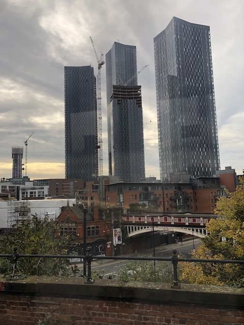
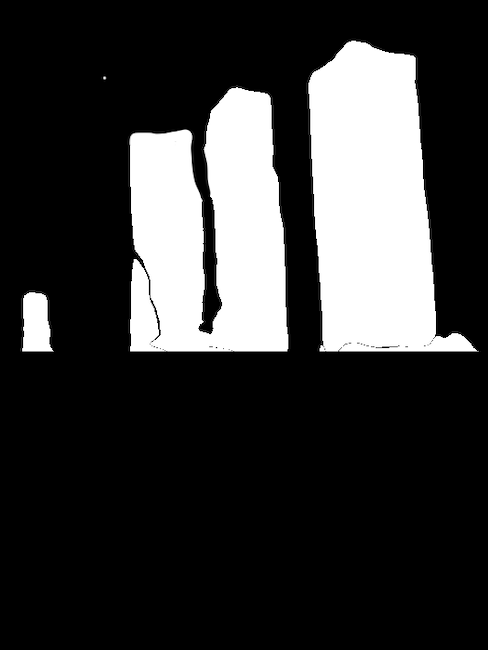
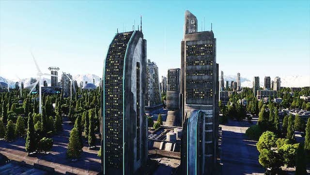
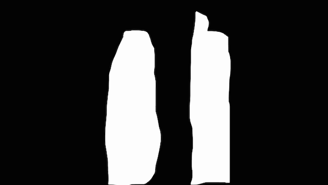
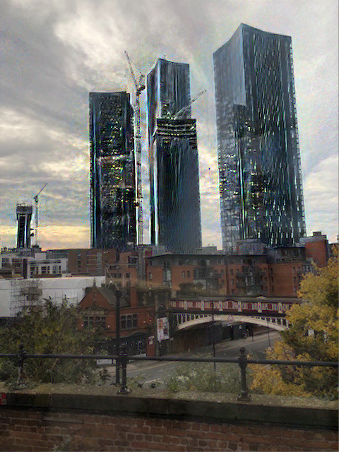
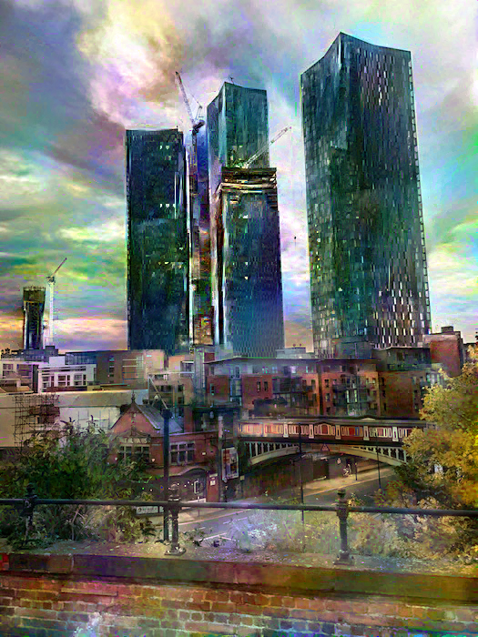
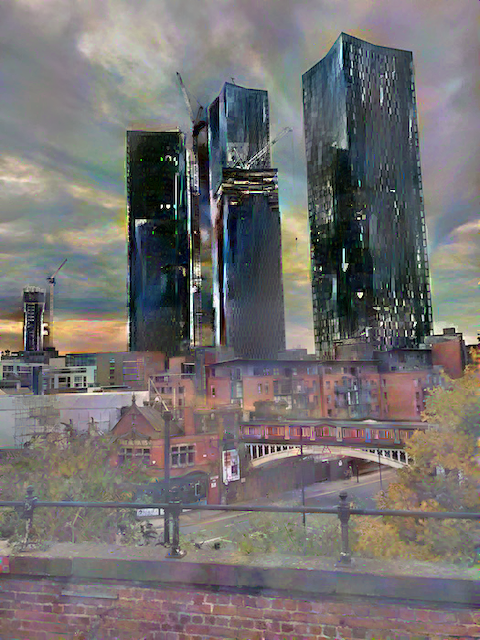

# Deep Photo Transfer for VFX

### Context
This code aims to improve on the work of Fujun Luan, Sylvain Paris, Eli Shechtman and Kavita Bala in their paper "Deep Photo Style Transfer" (https://arxiv.org/abs/1703.07511). 
The code works well on the provided examples, but I have identified issues transering style between somewhat dissimilar images.

For example, with the following images:

* Content image

* Content mask

* Style image

* Style mask

The following output is generated:

* Epoch 550

* Epoch 3000

* Final / best output

As can be seen in this final output, much of the unmasked area of the image has been in-painted, 
and the style is more reflective of painting than photo transfer. 
This is not evident in other photos, and suggests the following may not hold true in the current algorithm:

1) The masks are used accurately in calculating loss
1) Back propagation is ignoring the masks when adjusting the source image
1) The implementation of the code is bugged, and therefore the loss is not being calculated correctly (assume this is not true as in many examples the algorithm works)
1) The final step of the process performs some additional image manipulation which could be improved
1) The particular style image is too complex and doesn't translate well to the source image domain
1) The hyperparameters used for loss, etc. need modifying
1) The configuration of VGG19, including loss metrics at various layers, needs re-working for a wider set of use cases

Additionally, the algorithm appears to regress in performance at various stages of training, with later results worse than earlier ones

### Aims

The aim of this project is specifically:

1) To develop my own variant of deep photo style transfer, specifically focusing on transfering style in the identified mask regions. 
Note this could mean multiple runs through the transfer algorithm, with a "bring it all together" phase at the end (TBD)
1) To determine the limits of style transfer with this kind of approach, using code that is more in tune with my development standards.
1) To upskill on building complex computer vision algorithms, including the maths side of things!
1) To provide a set of building blocks that can be used in future algorithms (including GANs)

### Software stack

The current plan is to develop this using Pytorch (latest), removing some of the legacy dependencies of the original Python code 
(https://github.com/ray075hl/DeepPhotoStyle_pytorch) and moving away from LUA as per the original paper code (https://github.com/luanfujun/deep-photo-styletransfer).

The basis of my style transfer algorithms will be based on deep neural style transfer and some elements of the deep photo style transfer code.

